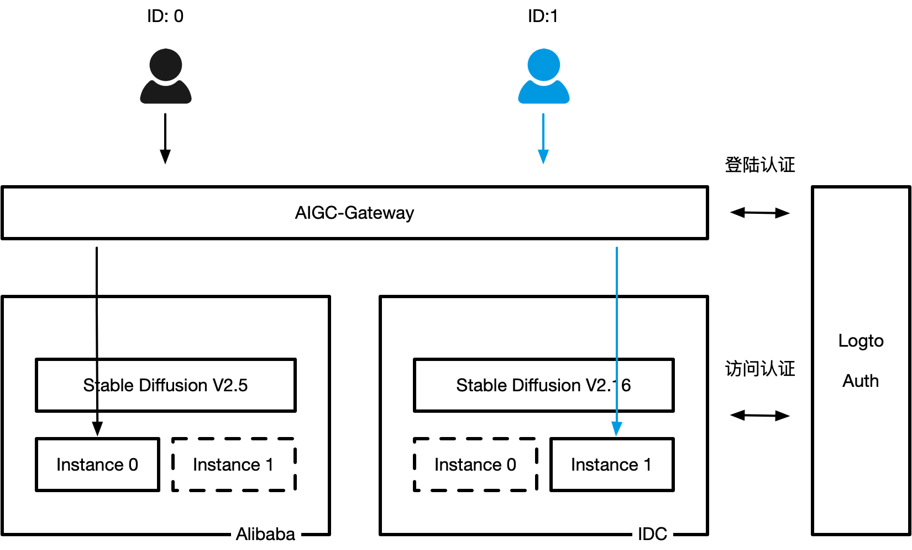

# AIGC-Gateway

中文 | [English](./docs/en/README.md)

## AIGC-Gateway概述

2023年，AIGC的潮流引爆了泛娱乐内容的生产力革命。文生图、文生音频、文生视频等AIGC范式成为了各大公司争相投入和落地生产的主要场景。目前AIGC领域主要分为两个大的场景，一个是面向终端客户的场景，例如：Midjourney或者Hugging Face；另外一个是面向内容生产者的场景，例如：Stable Diffusion。前置更多的是面向AIGC的服务化与商业化，而后者更多的面向企业内部数字资产生成与提效。大部分企业会通过第二种形态在企业内部落地AIGC的能力。

相比传统的互联网型业务而言，AIGC引擎的使用与运维具有如下特性：

- **运行时间碎片且弹性**

    通常 AIGC引擎的使用时间与内容生产者的使用周期是强相关的。因为目前为止，AIGC引擎生成内容的质量需要人进行评估与交互式的调整。这会导致从单个内容生产者的角度而言，使用的时间会非常碎片，而且使用的时间周期性区间会非常确定。一般情况下，只有在工作日的4-6个小时间时AIGC引擎集中使用的时间，而有效的使用时长会更短暂，工作日的晚上与双休日正常情况下也是没有任何使用时长的。

- **数字资产隔离与安全**

    对于很多以内容生产为主体的行业与公司而言，AIGC引擎中的自训练模型是数字核心资产。不同的内容生产者之间是非主动不自动共享模型的。而且不同的内容生产者之间，生成的内容需要做到访问隔离、防止篡改、数据隔离。

- **多种资源类型与弹性**

   AIGC引擎对GPU的异构算力是强依赖。但是，GPU的种类丰富，不同类型的GPU在成本和效率上的差异非常大。以Stable Diffusion为例，A100 40G显存与A100 80G显存在生成图片的效率上相差1s左右，但是成本上会相差1倍以上。此外，很多早期就涉足AIGC的公司在本地机房中都会有比较多的消费卡（例如：NV3090）。在企业内部落地AIGC引擎的时候，需要考虑如何将这些资源利用起来，并统一管理和提效。

- **引擎种类与版本繁多**

   AIGC引擎的迭代速度非常快，不同版本之间会存在一定的不兼容。而作为数字资产生成的工具，通常为了保障模型的稳定运行，一旦投入生产，大部分时间不会轻易变更版本。而不同的内容生产者之间依赖的版本极有可能也会有所不同。所以，多个版本如何统一的管理和升级，也是企业内部落地AIGC的时候需要考虑的事情。

## AIGC-Gateway特性

为了解决企业内部落地AIGC引擎的通用性问题，阿里云与行者AI一起开源了AIGC-Gateway项目，降低企业内部AIGC落地的难度与费用，真正做到开箱即用，即开即用。

AIGC-Gateway整体架构如下：

AIGC-Gateway具有如下特性：
- **动态拉起按需释放**

  对于任意一种AIGC引擎，AIGC-Gateway都可以做到，访问的时候拉起引擎，退出或者离开的时候，释放引擎所需的GPU资源，并保留数据存储。当下一次同一个用户访问的时候，快速拉起新的资源并挂载归属于这个客户的数据存储，实现GPU卡的分时复用，降低整体的成本投入。

- **租户独享访问隔离**

  通过AIGC-Gateway拉起的AIGC引擎资源独享，数据隔离。除此之外，访问地址通过OIDC的方式进行了安全防护，对任意一种AIGC引擎都可以无侵入式地实现访问的权限控制。此外，AIGC-Gateway通过与开源认证体系Logto的集成，实现了企业内部账号体系的自动单点登录与认证，简化了

- **统一GPU资源管理**

  AIGC-Gateway是一个与云厂商无关的开源项目，支持企业的IT工程师进行本地部署、混合云部署、多云部署。对于不同类型的GPU资源，例如：本地GPU、云上单卡GPU、云上多卡GPU、云上显存共享GPU都有完善的支持。

- **版本/模型统一管理**

  AIGC-Gateway支持同时部署多种、多套、多版本的AIGC引擎。并且，可以对同一个版本的AIGC引擎进行简单便捷的批量管理。并且支持在不同版本的AIGC引擎进行数据的迁移与切换。

- **成本核算与费用分摊**

  在阿里云上，可以通过可视化大盘和API的方式，实现组户级、实例级使用成本的核算，便于内部的成本核算以及成本单价的估算。

## 下一步

- [AIGC-Gateway Dashboard介绍](./docs/Dashboard介绍.md)
- [安装并配置AIGC-Gateway](./docs/安装部署.md)
- [如何部署多种AIGC引擎模版](./docs/模版管理.md)
- [AIGC-Gateway的架构与原理](./docs/架构原理.md)
- [常见问题与排查](./docs/常见问题.md)

## 上游项目

- [OpenKruiseGame](https://github.com/openkruise/kruise-game)
- [logto](https://github.com/logto-io/logto/)
