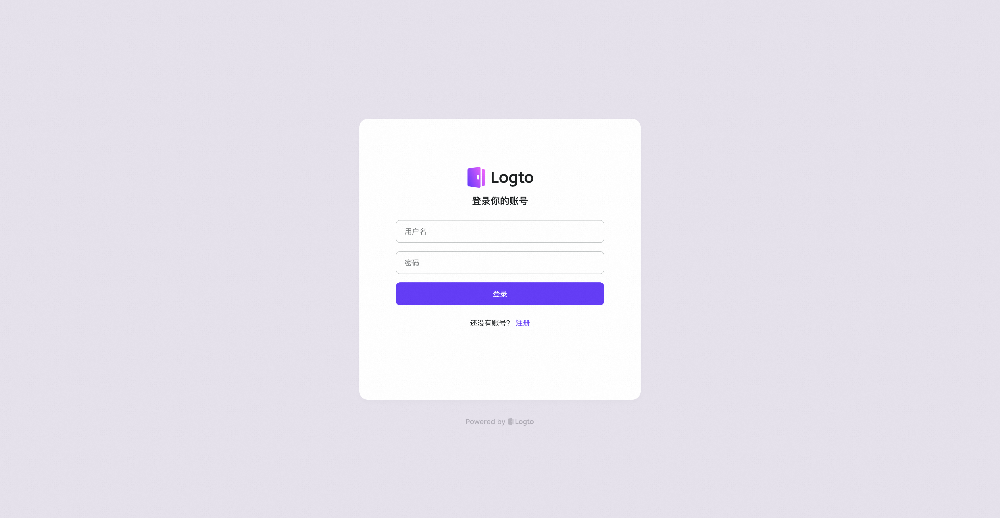
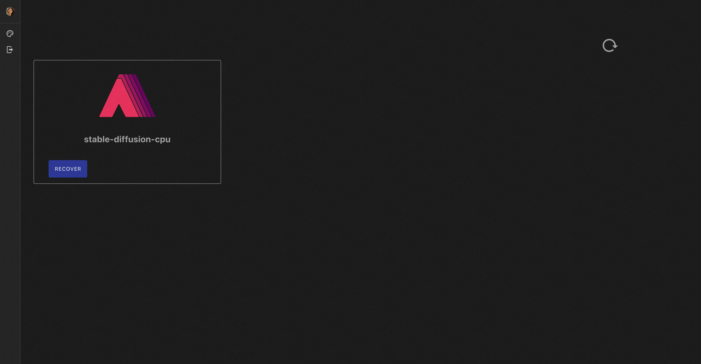
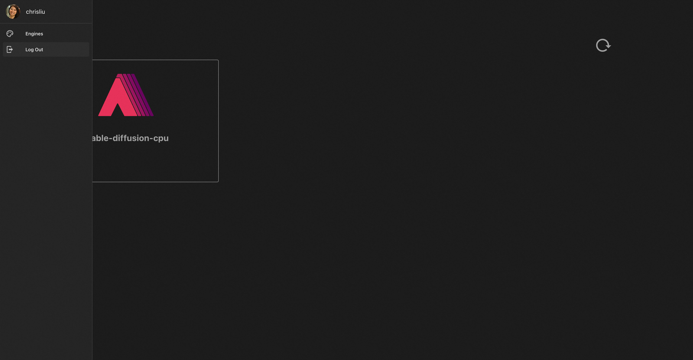

# AIGC-Gateway

This project aims to address the resource management issues of AIGC instances by providing an AIGC serverless gateway based on the auto-scaling feature of cloud-native architecture.

The gateway has the following features:

- User management. Each user has their own AIGC instance, and the gateway will maintain the mapping between the user and the instance.
- User-level resource management. AIGC computing instances are created and destroyed based on the user's login/offline status, while preserving user data.

## Dashboard of AIGC-Gateway

Click on Start to use.

Login or Register.

The new user does not own an AIGC instance, can choose to install the required instance.

After the installation is complete, the user can choose to access the corresponding instance.

Click on PAUSE to release instance. After instance released, user can click on RECOVER to reload the AIGC instance, without losing user data.

Click on Logout, return to initial page.

## What's next

- [Install AIGC-Gateway](./docs/安装部署.md)

