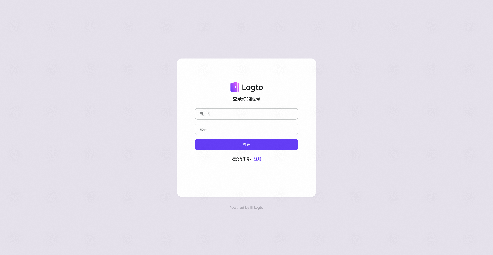
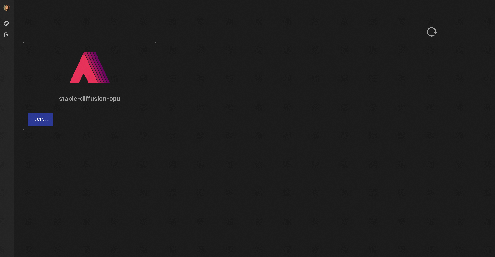
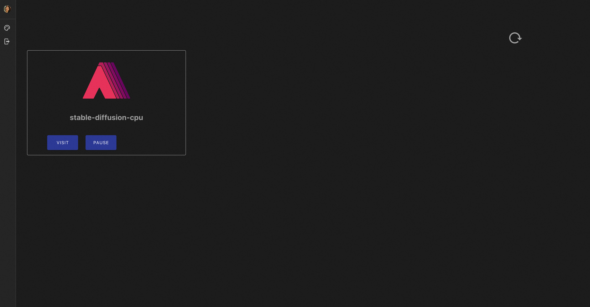
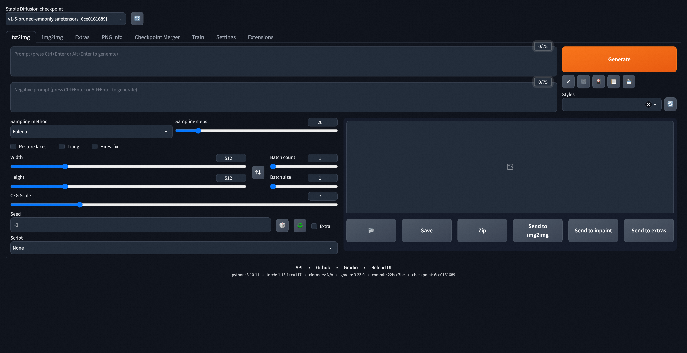
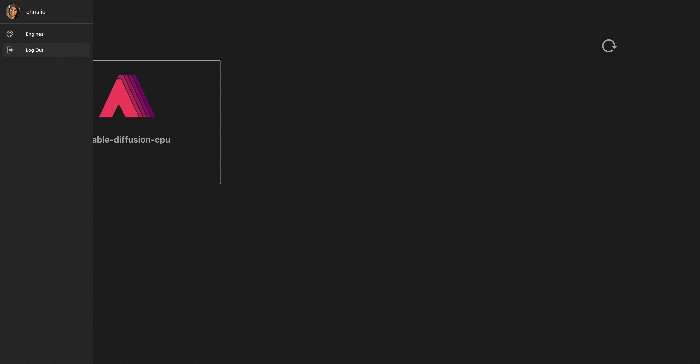

## 初始页面

访问AIGC-Gateway地址，进入初始页面。点击START TO USE，将进入用户个人控制台。

## 用户认证页面

当用户未处于登录态，需要登录帐号进行身份认证。

## 用户个人控制台

### 安装

新用户登录后不存在属于自己的AIGC实例，可以选择对应模版，安装所需实例。

### 使用

当实例完成安装，用户可以点击VISIT访问对应实例

本例中使用 Stable-Diffusion，点击VISIT后跳转至SD页面

### 停止与恢复

当用户使用完成，可以点击PAUSE释放实例。当实例完成释放，用户可以点击RECOVER来重载该实例，实例的持久化数据会再次加载进来，不会丢失。

### 登出

用户完成使用，可以点击左边栏中Log Out，退出登录态

