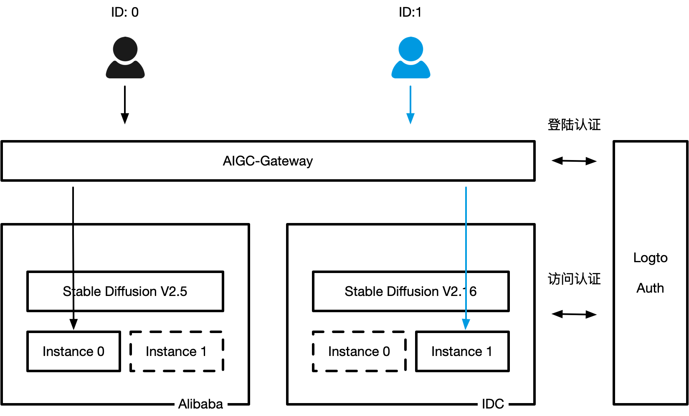

# AIGC-Gateway
[中文](../../README.md) | English

## Overview of AIGC-Gateway

In 2023, The trend of AIGC (Artificial Intelligence Generated Content) ignited a productivity revolution in the production of pan-entertainment content. AIGC paradigms such as AIGC graphics, AIGC audio, and AIGC video became the main scene for major companies to invest in and land production. Currently, the AIGC field is mainly divided into two major scenes: one is the scene for end customers, such as Midjourney or Hugging Face; the other is the scene for content producers, such as Stable Diffusion. The former is more focused on the service and commercialization of AIGC, while the latter is more focused on generating digital assets and improving efficiency within the enterprise. Most companies will use the second form to land AIGC capabilities within the enterprise.

Compared to traditional internet-based businesses, the use and operation of AIGC engines have the following characteristics:

- **Fragmented and Elastic Runtime** 

    Usually, the usage time of AIGC engines is strongly related to the usage cycle of content producers. So far, the quality of AIGC engine-generated content requires manual evaluation and interactive adjustment. This will result in very fragmented usage time from the perspective of a single content producer, and the usage time interval will be very certain. Generally, the AIGC engine is only used for 4-6 hours on working days, and the effective usage time will be even shorter. There is usually no usage time on weekday evenings and weekends.

- **Digital Asset Isolation and Security** 

    For many industries and companies that are mainly content producers, the self-trained models in AIGC engines are digital core assets. Different content producers do not actively share models with each other. In addition, the content generated by different content producers needs to achieve access isolation, prevent tampering, and data isolation.

- **Multiple Resource Types and Elasticity** 

    AIGC engines strongly depend on the heterogeneous computing power of GPUs. However, there are many types of GPUs, and the cost and efficiency differences between different types of GPUs are very large. For example, in Stable Diffusion, the efficiency of generating images with A100 40G VRAM and A100 80G VRAM is about 1 second different, but the cost is more than twice as expensive for A100 80G VRAM. In addition, many companies that have been involved in AIGC for a long time will have quite a few consumer cards (such as NV3090) in their local data centers. When landing AIGC engines within the enterprise, it is necessary to consider how to utilize these resources and unify management and improve efficiency.

- **Various Types and Versions of Engines** 

    The iteration speed of AIGC engines is very fast, and there may be some incompatibilities between different versions. As a tool for generating digital assets, it is usually difficult to change the version once it is put into production to ensure the stable operation of the model. The versions that different content producers rely on may also differ significantly. Therefore, how to manage and upgrade multiple versions uniformly is also something that needs to be considered when landing AIGC within the enterprise.

## Features of AIGC-Gateway

In order to solve the universality problem of landing AIGC engines within the enterprise, Alibaba Cloud and Xingzhe AI (Longyuan Games) have open-sourced the AIGC-Gateway project to reduce the difficulty and cost of landing AIGC within the enterprise, and truly achieve plug-and-play.

The AIGC-Gateway has the following features:

- **Dynamic Launch and On-Demand Release** 

    AIGC-Gateway can launch any AIGC engine on demand and release the required GPU resources while preserving the data storage when exiting or leaving. When the same user accesses again, AIGC-Gateway can quickly launch new resources and mount the data storage belonging to this customer, achieving time-sharing reuse of GPU cards and reducing overall cost investment.

- **Tenant Exclusive Access Isolation** 

    The AIGC engine resources launched by AIGC-Gateway are exclusive to the tenant and data is isolated. In addition, access addresses are secured through OIDC for non-intrusive access control of any AIGC engine. Additionally, AIGC-Gateway integrates with the open-source authentication system Logto to achieve automatic single sign-on and authentication for enterprise internal account systems, simplifying the process.

- **Unified GPU Resource Management** 

    AIGC-Gateway is an open-source project that is cloud vendor independent and supports local deployment, hybrid cloud deployment, and multi-cloud deployment by enterprise IT engineers. It fully supports different types of GPU resources, such as local GPU, cloud single-card GPU, cloud multi-card GPU, and cloud-shared memory GPU.

- **Version/Model Unified Management** 

    AIGC-Gateway supports simultaneous deployment of multiple, multiple sets, and multiple versions of AIGC engines. It can also perform simple and convenient batch management for AIGC models of the same version and support data migration and switching between different versions of AIGC engines.

- **Cost Accounting and Cost Allocation** 

    On Alibaba Cloud, cost accounting for user and instance levels can be achieved through a visual dashboard and API, facilitating internal cost accounting and cost unit price estimation.

## What's Next

- [Introduction of AIGC-Gateway Dashboard](../../docs/Dashboard介绍.md)
- [Install & Config AIGC-Gateway](../../docs/安装部署.md)
- [Deploy multi AIGC Engine Templates](../../docs/模版管理.md)
- [Architecture & Principle of AIGC-Gateway](../../docs/架构原理.md)
- [Q&A](../../docs/常见问题.md)

## Upstream Project

- [OpenKruiseGame](https://github.com/openkruise/kruise-game)
- [logto](https://github.com/logto-io/logto/)