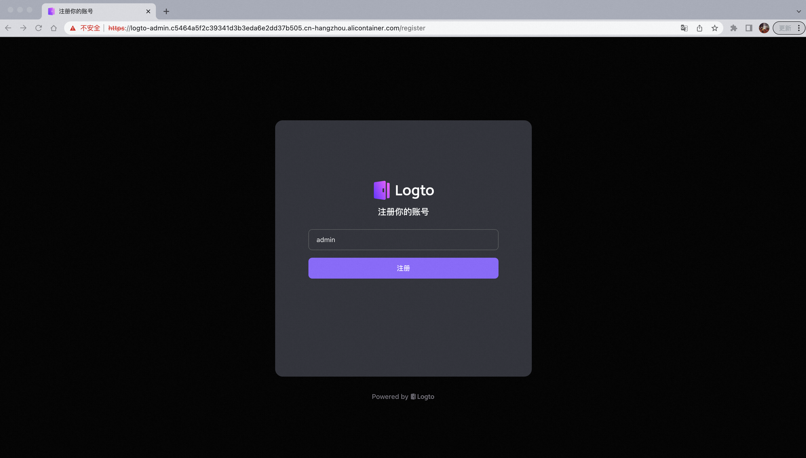
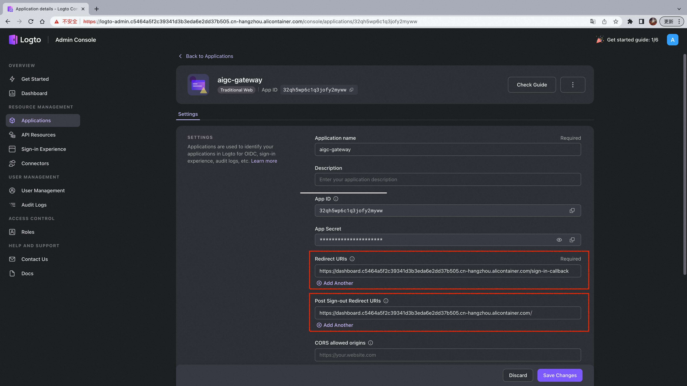

本文介绍如何将AIGC-Gateway部署至Kubernetes集群

AIGC-Gateway 包含两个组件
- logto。用作用户身份认证，实现单点登录。
- aigc-gateway。计算资源管理，同时维护用户与实例的映射关系。

完整地安装AIGC-Gateway需要经历以下步骤：
1. 生成logto证书，并在k8s集群中安装logto
2. 在logto admin控制台配置logto参数，并获取应用ID/secret等
3. 根据第二步中获取的信息，填写aigc-gateway相关参数，并安装

## 1. 安装logto

此步骤将会部署一个logto pod与一个postgress pod。logto用作用户鉴权，postgress用作logto对应数据库。建议生产环境采用独立的高可用数据库或云提供商数据库。

### 1.1 生成证书，并创建对应secret对象

AIGC-Gateway 通过logto进行用户身份认证，默认通过 HTTPS 访问，因此需要提前准备证书，以下我们通过OpenSSL生成自定义证书用于测试，正式生产用途建议申请受信任的企业证书。

```bash
openssl req -x509 -nodes -days 365 -newkey rsa:2048 -keyout tls.key -out tls.crt -subj "/CN=c5464a5f2c39341d3b3eda6e2dd37b505.cn-hangzhou.alicontainer.com/O=c5464a5f2c39341d3b3eda6e2dd37b505.cn-hangzhou.alicontainer.com"

kubectl create ns aigc-gateway
kubectl -n aigc-gateway create secret tls tls-logto --key tls.key --cert tls.crt
```

### 1.2 编辑./deploy/helm/logto/values.yaml

```yaml
  adminEndpoint: "logto-admin.c5464a5f2c39341d3b3eda6e2dd37b505.cn-hangzhou.alicontainer.com" #logto admin控制台域名
  endpoint: "logto.c5464a5f2c39341d3b3eda6e2dd37b505.cn-hangzhou.alicontainer.com" #logto域名
  secretName: "tls-logto" #第1.1步中生成的secret的名称
  installation:
    namespace: aigc-gateway #与第1.1步中生成的secret同命名空间
    createNamespace: false #如若存在该ns，则不需要创建新的
```

### 1.3 安装 logto helm chart
```bash
helm install logto ./deploy/helm/logto
```

## 2. 配置logto参数

### 2.1 登录logto admin控制台

访问logto admin控制台，进行logto相关参数配置。首次登录时创建admin账户，生成管理员



### 2.2 创建Traditional Web应用
输入用户名密码后，进入admin控制台，点击Application，点击Traditional Web，输入应用名称为aigc-gateway，创建应用。该配置页记录了AIGC-Gateway应用与logto交互的信息，其生成的ID与Secret将作为AIGC-Gateway的参数。


跳过应用指引，在配置页面输入aigc-gateway域名（例如 dashboard.c5464a5f2c39341d3b3eda6e2dd37b505.cn-hangzhou.alicontainer.com）相关的两处URIs：

- Redirect URIs：https://{aigc-gateway域名}/sign-in-callback 
  - 例如：https://dashboard.c5464a5f2c39341d3b3eda6e2dd37b505.cn-hangzhou.alicontainer.com/sign-in-callback
- Post Sign-out URIs：https://{aigc-gateway域名}/ 
  - 例如：https://dashboard.c5464a5f2c39341d3b3eda6e2dd37b505.cn-hangzhou.alicontainer.com/

点击保存更改



### 2.3 创建Machine-to-Machine应用
Machine-to-Machine将赋予AIGC-Gateway管理登录用户与后端资源实例信息映射关系的权限。点击Application，点击Machine-to-Machine,输入自定义应用名称，点击创建。


在配置页面点击右下方Enable admin access按钮，点击保存更改


## 3. 安装AIGC-Gateway

### 3.1 编辑./deploy/helm/aigc-gateway/values.yaml

```yaml
  installation:
    namespace: aigc-gateway #建议与logto命名空间保持一致
  image:
    repository: registry.cn-hangzhou.aliyuncs.com/acs/aigc-gateway
    tag: v1.1.0
  appId: "32qh5wp6c1q3jofy2myww" #在Traditional Web配置页中找到AppID并填入
  appSecret: "35mpn2dk62brjxaduy7x0" #在Traditional Web配置页中找到AppSecret并填入
  m2mId: "ezxyaol30ld99c7ns5u2r" #在Machine-to-Machine配置页中找到AppID并填入
  m2mSecret: "g7hly3nwq2omligpyh3ck" #在Machine-to-Machine配置页中找到AppSecret并填入
  host: "dashboard.c5464a5f2c39341d3b3eda6e2dd37b505.cn-hangzhou.alicontainer.com" #输入AIGC-Gateway配置的域名，该域名也是用户的访问端点
  endpoint: "https://logto.c5464a5f2c39341d3b3eda6e2dd37b505.cn-hangzhou.alicontainer.com/" #输入由logto域名组成的对应端点
  secretName: "tls-logto" #输入AIGC-Gateway对应的证书secret（本例中AIGC-Gateway证书与logto证书一致）
```

### 3.2 安装 aigc-gateway helm chart
```bash
helm install aigc-gateway ./deploy/helm/aigc-gateway
```

---

## What's next

- [模版管理](./模版管理.md)

