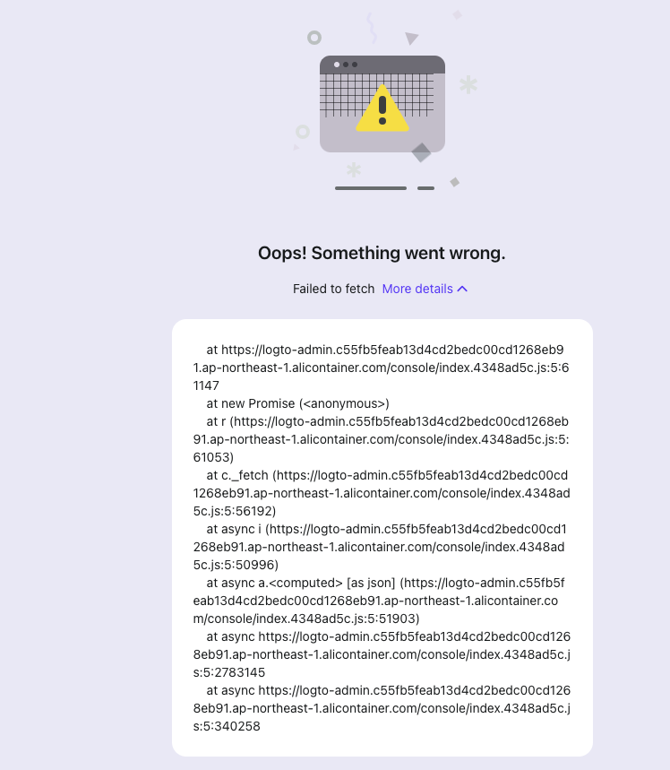

## 常见问题与处理

### 浏览器页面出现：post_logout_redirect_uri not registered

用户logout的时候报错：
```json
{"message":"OIDC 内部错误: invalid_request","code":"oidc.provider_error","data":{"error_description":"post_logout_redirect_uri not registered"}}
```
在logto admin控制台查看Tradition APP中设置的Post Sign-out Redirect URIs是否与集群中aigc-gatway的环境变量Redirect_Url一致。
通常情况下是因为，Post Sign-out Redirect URIs 的结尾缺少或多填写了 “/”

### 点击AIGC引擎的Install/Recover后出现转圈圈，刷新后无法访问

造成该情况出现有两个可能原因：
a. 实例pod创建失败。可通过kebectl describe po {实例名称} -n {实例命名空间} 来查看创建失败原因。
b. 实例访问网络创建失败。kebectl get gs {实例名称} -n {实例命名空间} -oyaml 找到network Status字段，查看网络是否Ready。

### 点击visit后无法访问

- 首先，确定访问路径与登录用户是否匹配，该用户是否具有对应实例的访问权限。
- 若匹配，kebectl get ingress {实例名称} -n {实例命名空间} 查看ingress是否存在且状态正常。查看对应annotation是否（如模版管理一节中示例所示）设置正确。
- 若实例ingress正常，在浏览器端检查名为logto-session 的 cookie 对应domain是否是如下格式
```
.{aigc-gateway根域名}

#若aigc-gateway域名为dashboard.c5464a5f2c39341d3b3eda6e2dd37b505.cn-hangzhou.alicontainer.com
#cookie对应domain应为 .c5464a5f2c39341d3b3eda6e2dd37b505.cn-hangzhou.alicontainer.com
```

### 点击Start To Use进入失败，登录超时

例如浏览器点击后出现以下类似错误
```
 Get "https://logto.cdadd9cd45d964c2694c15d4a4ad8fe37.ap-northeast-1.alicontainer.com/oidc/.well-known/openid-configuration": dial tcp 47.74.14.253:443: connect: connection timed out
```

- 问题表因：aigc-gateway 访问 logto失败，无法跳转登录页面
- 可能根因：Kubernetes集群内访问集群LoadBalancer暴露的SLB地址不通。可尝试在aigc-gateway容器中访问nginx对应SLB地址确认问题。
- 解决方法：面对阿里云ACK的使用者，可以通过升级Terway到最新版本解决。具体操作为：ACK集群控制台 -> 组件管理 -> 网络 -> 先升级terway-eniip -> 再升级terway-controlplane

### logto admin dashboard 出现 Oops! Something went wrong

例如下图所示情况



- 问题原因：使用自签证书时，浏览器还没有授予logto域名的访问权限。
- 解决方法：手动访问logto域名，点击信任即可。