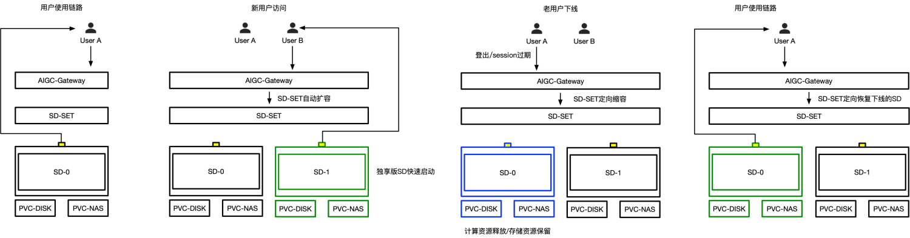
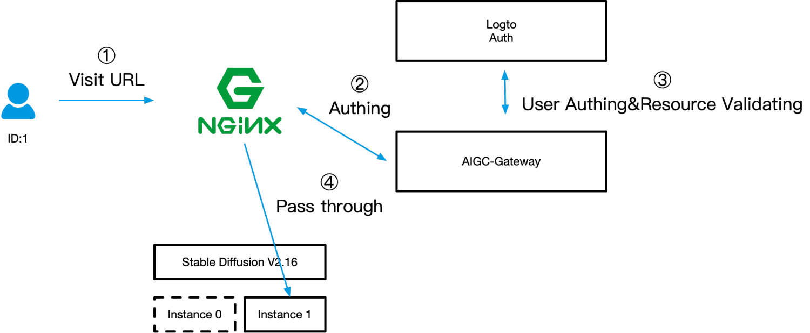

## AIGC-Gateway是如何实现快速拉起和释放的？

AIGC-Gateway是通过容器的方式拉起和释放AIGC实例的，在有镜像缓存和模型异步加载的情况下，可以做到秒级的启动。此外，AIGC引擎的管理是通过开源项目OpenKruiseGame来进行管理的，可以通过配置服务质量的方式配置自定义的下线策略，实现企业对用户登出行为的自定义。拓展阅读：https://openkruise.io/zh/kruisegame/user-manuals/autoscale/

## AIGC-Gateway是如何如何实现用户访问控制的？

默认AIGC-Gateway的网络是通过Ingress的方式进行透出的。AIGC-Gateway提供了增强的OAuth接口，支持在访问的时候认证登录态的同时，还可以校验资源和用户的归属。

## AIGC-Gateway是如何实现AIGC引擎管理的？

不同类型、不同版本、不同资源的AIGC引擎在AIGC-Gateway中是通过不同配置的Yaml模版来进行抽象的，增加、修改、变更一个AIGC引擎的配置，只需要修改对应的模版即可。AIGC-Gateway是通过Kubernetes中的接口反查获取的，无任何的内置和绑定，对开发者而言是完全开放的。

## AIGC-Gateway是如何实现GPU资源管理的？

不同的GPU资源，可以通过在负载中设置不同的Resource与调度策略的方式来实现，如果需要资源混合，例如：云下有3090的消费卡，云上有A100的数据中心卡，可以通过配置Kubernetes中的Affinity的方式实现优先使用云下资源，云下资源没有再使用云上资源。

## 如何配置自动拉起和自动释放的策略

AIGC-Gateway可以通过配置探测脚本的方式标注用户离开的状态，例如：可以以无网络访问来判断用户的离开，并结合keda实现自动伸缩。拓展阅读：https://openkruise.io/zh/kruisegame/user-manuals/service-qualities

## 如何查看生成的图片与文件
AIGC-Gateway可以通过在Sidecar中配置filebrowser的方式，实现web控制台的文件访问。