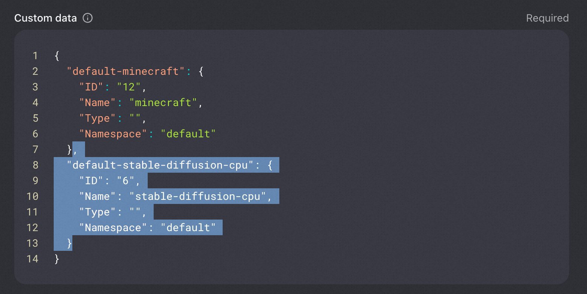
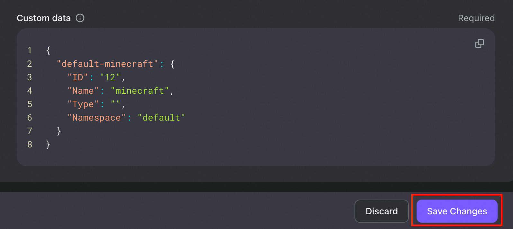

AIGC-Gateway支持管理员自定义创建多种AIGC模版，模版初始部署在集群中时，集群不存在对应实例。管理员每部署一个模版，用户Dashboard视图中都会出现一个新的待安装的AIGC模型，当用户选择安装对应模版时，AIGC-Gateway会为该用户创建对应新的实例。

## 前置依赖

管理员需在Kubernetes集群中安装AIGC实例管理组件OKG(OpenKruiseGame)，具体信息请参考：https://openkruise.io/zh/kruisegame/installation

```yaml
$ helm repo add openkruise https://openkruise.github.io/charts/

$ helm repo update

$ helm install kruise openkruise/kruise --version 1.4.0

$ helm install kruise-game openkruise/kruise-game --version 0.4.1
```

## 模版部署

AIGC-Gateway中模版的概念等同于OKG中的GameServerSet对象，安装OKG后，管理员可在集群中部署多套AIGC示例模版(多组GameServerSet)。

以下是部署一个模版（GameServerSet）的示例。其中关键字段的说明如下：
- spec.replicas 副本数目一定设置为0。因为模版下发后，不应存在任何实例，实例是由用户选择创建。
- spec.gameServerTemplate.volumeClaimTemplates 用作创建属于用户个人的数据盘。该存储对象与实例生命周期解耦，也就是说，用户在释放计算实例后，个人数据并不丢失，实例恢复时数据重新加载。
- spec.network 用于声明实例的访问网络。具体字段填写说明可参考示例中注释。

```
cat <<EOF | kubectl apply -f -
apiVersion: game.kruise.io/v1alpha1
kind: GameServerSet
metadata:
  name: stable-diffusion-cpu # 该模版的自定义名称
spec:
  replicas: 0 # 初始的实例数目，要设置为0，代表初始不存在任何实例。
  scaleStrategy:
    scaleDownStrategyType: ReserveIds
  gameServerTemplate:
    spec:
      containers:
        - args:
            - --listen
            - --skip-torch-cuda-test
            - --no-half
          command:
            - python3
            - launch.py
          image: yunqi-registry.cn-shanghai.cr.aliyuncs.com/lab/stable-diffusion:v1.0.0-cpu
          name: stable-diffusion
          readinessProbe:
            failureThreshold: 3
            initialDelaySeconds: 5
            periodSeconds: 10
            successThreshold: 1
            tcpSocket:
              port: 7860
            timeoutSeconds: 1
          volumeMounts:
            - mountPath: /root/stable-diffusion #持续化数据所在容器中的目录
              name: user-data
    volumeClaimTemplates: # 为每一个实例分配持久化存储盘，实例释放但数据不丢失
      - apiVersion: v1
        kind: PersistentVolumeClaim
        metadata:
          name: user-data
        spec:
          accessModes:
          - ReadWriteOnce
          resources:
            requests:
              storage: 50Gi
          storageClassName: alicloud-disk-essd
          volumeMode: Filesystem
  updateStrategy:
    rollingUpdate:
      podUpdatePolicy: InPlaceIfPossible
      maxUnavailable: 100%
  network:
    networkType: Kubernetes-Ingress
    networkConf:
      - name: IngressClassName
        value: nginx
      - name: Port
        value: "7860" #AIGC实例暴露的端口
      - name: Host 
        #AIGC实例访问的域名，每个实例有各自的域名，用<id>区分。如实例0的域名为instances0...; 实例1的域名为instances1...
        #注意，该域名需要与aigc-gateway具有相同根域名，此例中为c5464a5f2c39341d3b3eda6e2dd37b505.cn-hangzhou.alicontainer.com
        value: instances<id>-cpu.c5464a5f2c39341d3b3eda6e2dd37b505.cn-hangzhou.alicontainer.com
      - name: PathType
        value: ImplementationSpecific
      - name: Path
        value: /
      - name: Annotation
        #用作实例访问鉴权，特定实例的访问权限只属于特定用户。下面的域名替换为AIGC-Gateway实际域名
        value: 'nginx.ingress.kubernetes.io/auth-url: https://dashboard.c5464a5f2c39341d3b3eda6e2dd37b505.cn-hangzhou.alicontainer.com/auth'
      - name: Annotation
      	#实例访问鉴权失败后进行登录认证。下面的域名替换为AIGC-Gateway实际域名
        value: 'nginx.ingress.kubernetes.io/auth-signin: https://dashboard.c5464a5f2c39341d3b3eda6e2dd37b505.cn-hangzhou.alicontainer.com/sign-in'
EOF
```

以上模版为SD使用CPU的例子。通常，可以将不同的AIGC模型部署为不同的模版，使用不同GPU计算规格的模型部署成不同的模版，甚至可以将不同版本的模型部署成不同模版，AIGC-Gateway管理员可自行定义。

例如，部署单卡GPU的模版如下所示（以下 #... 代表省略的部分）

```yaml
#...
  gameServerTemplate:
    spec:
      containers:
        - #...
          resources:
          	limits:
            	nvidia.com/gpu: 1 #申请一张GPU卡
#...
```

例如，部署共享GPU的模版如下所示，该模版生成的实例将使用3GiB显存的GPU

```yaml
#...
  gameServerTemplate:
    spec:
      containers:
        - #...
          resources:
            limits:
              # 单位为GiB，该Pod总共申请了3 GiB显存。
              aliyun.com/gpu-mem: 3 # 设置GPU显存大小。
#...
```

例如，ECI-CPU模版如下所示

```yaml
#...
  gameServerTemplate:
    metadata:
      labels:
        alibabacloud.com/eci: "true"
    spec:
      containers:
        - #...
          resources:
            limits:
              #生成实例将使用2核4G计算资源
              cpu: "2"
              memory: 4Gi
#...
```

例如，ECI-GPU模版如下所示

```yaml
#...
  gameServerTemplate:
    metadata:
      labels:
        alibabacloud.com/eci: "true"
      annotations:
        k8s.aliyun.com/eci-use-specs: ecs.gn7i-c8g1.2xlarge #在此实例指定规格
    spec:
      containers:
        - #...
          resources:
          	limits:
            	nvidia.com/gpu: 1 #申请一张GPU卡
#...
```

## 模版更新

当平台决定更新模版镜像、规格等参数时，管理员可以操作对应GameServerSet对象：

```shell
kubectl edit gss stable-diffusion-cpu -n default
```

需要注意的是：

- 避免更改`replicas`与`reserveGameServerIds`字段。
- `gameServerTemplate`下的字段更新后，该模版下的实例将重启，会对正在使用的用户造成影响。【若存在无感升级的需求可以发布issue，我们将后续补充相关功能】

## 模版删除

当平台决定下线某版本模型时，可进行模版删除。
需要注意的是，删除模版后，对应的所有实例也将删除。
此外，管理员需要手动进行用户数据清理动作。
具体操作如下：

1. 在Kubernetes集群中删除GameServerSet对象，如删除上述部署在`default`命名空间的`stable-diffusion-cpu`

```shell
kubectl delete gss stable-diffusion-cpu -n default
```

2. 清理所有用户相关元数据

登录logto admin Dashboard，进入用户管理（User Management），依次遍历所有用户，找到Custom data，删除对应模版下的所有信息，点击保存。如图所示：




【若存在自动清理的需求可以发布issue，我们将后续补充相关功能】