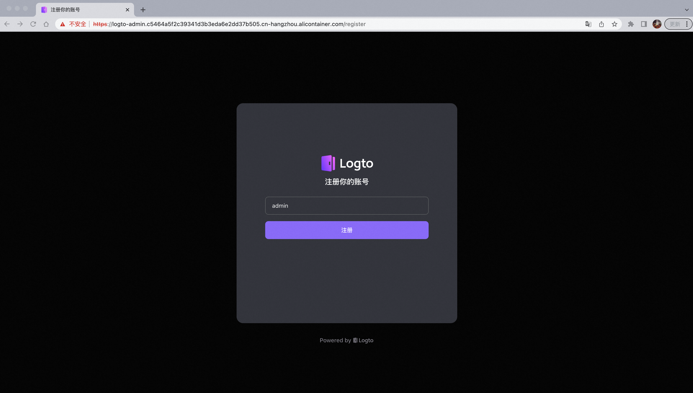
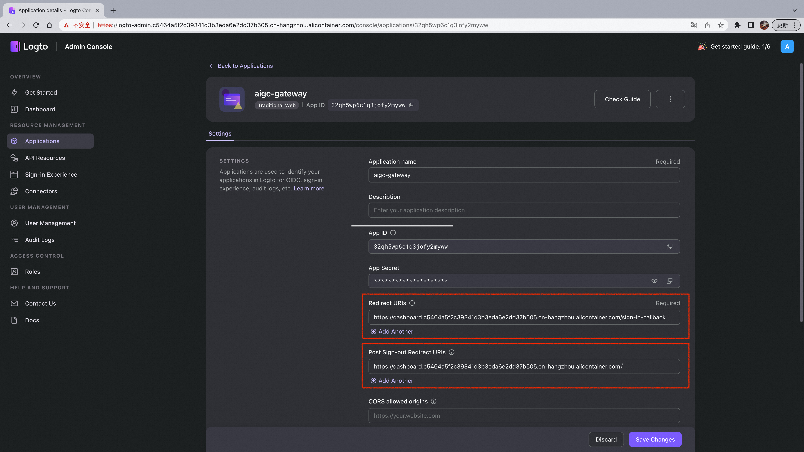

本文介绍如何将AIGC-Gateway部署至Kubernetes集群

## 0. 生成证书，并创建对应secret对象

## 1. 安装logto

### 1.1 编辑./deploy/helm/logto/values.yaml

```yaml
  adminEndpoint: "logto-admin.c5464a5f2c39341d3b3eda6e2dd37b505.cn-hangzhou.alicontainer.com" #logto admin控制台域名
  endpoint: "logto.c5464a5f2c39341d3b3eda6e2dd37b505.cn-hangzhou.alicontainer.com" #logto域名
  secretName: "tls-logto" #第0步中生成的secret的名称
  installation:
    namespace: aigc-gateway #与第0步中生成的secret同命名空间
    createNamespace: false #如若存在该ns，则不需要创建新的
```

### 1.2 安装 logto helm chart
```bash
helm install logto ./deploy/helm/logto
```

## 2. 配置logto参数

### 2.1 登录logto admin控制台

首次登录时创建admin账户，生成管理员



### 2.2 创建Traditional Web应用
输入用户名密码后，进入admin控制台，点击Application，点击Traditional Web，输入应用名称为aigc-gateway，创建应用


跳过应用指引，在配置页面输入aigc-gateway域名相关的两处URIs：

- Redirect URIs：https://{aigc-gateway域名}/sign-in-callback
- Post Sign-out URIs：https://{aigc-gateway域名}

点击保存更改



### 2.3 创建Machine-to-Machine应用
点击Application，点击Machine-to-Machine,输入自定义应用名称，点击创建


在配置页面点击右下方Enable admin access按钮，点击保存更改


## 3. 安装AIGC-Gateway

### 3.1 编辑./deploy/helm/aigc-gateway/values.yaml

```yaml
  installation:
    namespace: aigc-gateway #建议与logto命名空间保持一致
  image:
    repository: registry.cn-beijing.aliyuncs.com/chrisliu95/aigc-gateway
    tag: v0.0.1
  appId: "32qh5wp6c1q3jofy2myww" #在Traditional Web配置页中找到AppID并填入
  appSecret: "35mpn2dk62brjxaduy7x0" #在Traditional Web配置页中找到AppSecret并填入
  m2mId: "ezxyaol30ld99c7ns5u2r" #在Machine-to-Machine配置页中找到AppID并填入
  m2mSecret: "g7hly3nwq2omligpyh3ck" #在Machine-to-Machine配置页中找到AppSecret并填入
  host: "dashboard.c5464a5f2c39341d3b3eda6e2dd37b505.cn-hangzhou.alicontainer.com" #输入AIGC-Gateway配置的域名
  endpoint: "https://logto.c5464a5f2c39341d3b3eda6e2dd37b505.cn-hangzhou.alicontainer.com/" #输入由logto域名组成的对应端点
  secretName: "tls-logto" #输入AIGC-Gateway对应的证书secret（本例中AIGC-Gateway证书与logto证书一致）
```

### 3.2 安装 aigc-gateway helm chart
```bash
helm install aigc-gateway ./deploy/helm/aigc-gateway
```